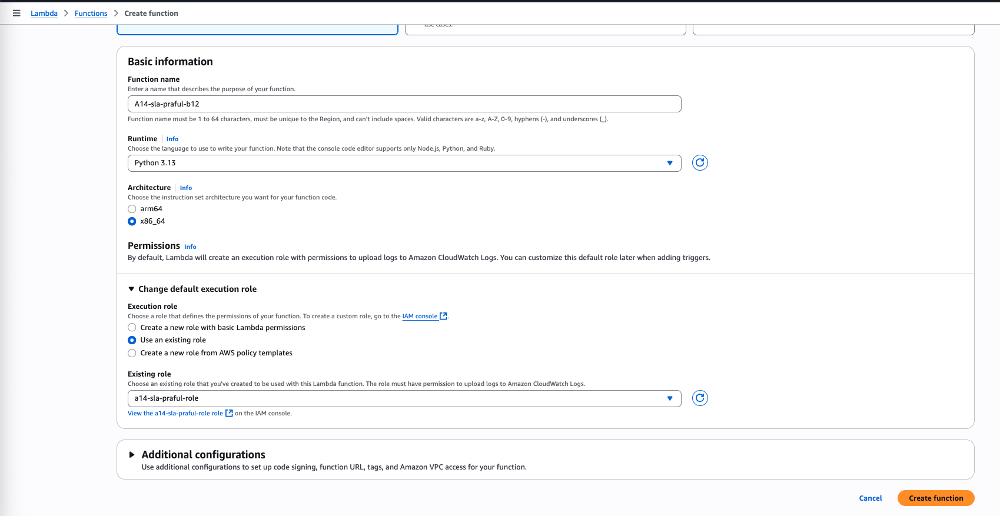

# Graded Assignment: Serverless Architecture  

## Assignment 1: Automated Instance Management Using AWS Lambda and Boto3  

### 🎯 Objective  
The goal of this assignment is to gain hands-on experience with **AWS Lambda** and **Boto3** (Amazon’s SDK for Python). You will create a Lambda function that automatically manages EC2 instances (start/stop) based on their **tags**.  

---

### 🔧 Steps Implemented  

#### 1. **EC2 Instance Creation**  
- Created EC2 instances to demonstrate **AutoStart** and **AutoStop** functionality.  
  

#### 2. **Tagging EC2 Instances**  
- Added **`action=AutoStart`** tag to instances that should start automatically.  
  

- Added **`action=AutoStop`** tag to instances that should stop automatically.  
  

#### 3. **IAM Role Configuration**  
- Created a new IAM Role for Lambda execution.  
  

- Attached the **AmazonEC2FullAccess** policy to allow Lambda to manage EC2.  
  

- Verified role configuration.  
  

- IAM Role created successfully.  
  

#### 4. **Lambda Function Setup**  
- Created a Lambda function with Python runtime.  
  

- Implemented the Lambda function to:  
  - Start instances tagged with **AutoStart**.  
  - Stop instances tagged with **AutoStop**.  
  

#### 5. **Execution & Validation**  
- **Before Execution:** Instances were in their initial states.  
  

- **Execution Output:** Lambda function executed successfully.  
  

- **After Execution:** Instances transitioned to the expected states (stopped/started based on tags).  
  

---

### ✅ Outcome  
- Successfully automated **EC2 instance management** using **AWS Lambda** and **Boto3**.  
- Instances responded correctly to **AutoStart** and **AutoStop** tags.  
- IAM role permissions were correctly applied to allow Lambda execution.  

---

# Assignment 5: Auto-Tagging EC2 Instances on Launch Using AWS Lambda and Boto3

## 🎯 Objective  
Automate the tagging of EC2 instances as soon as they are launched using **AWS Lambda** and **Boto3**, ensuring better resource tracking and management.

---

## 🛠️ Steps Followed  

### 1. Create Lambda Function  
- Navigate to **AWS Lambda** console.  
- Create a new function using **Python 3.x** runtime.  
- Attach the IAM role with `AmazonEC2FullAccess` policy.  
- Add the Python code to automatically tag instances with:  
  - Current date (`CreatedOn` tag).  
  - A custom tag (`A5-Praful-b12-tag`).  

---

### 2. Create EventBridge Rule  
- Navigate to **Amazon EventBridge**.  
- Create a new rule that listens to **EC2 Instance State-change Notification** events with `"state": "running"`.  
- Set the target as the Lambda function created earlier.  

#### EventBridge Setup Screenshots
  
  
  
  
  

---

### 3. Verify Lambda Execution  
- Checked **CloudWatch Logs** to confirm that the Lambda was triggered with correct instance details.  

---

### 4. Test by Launching EC2 Instance  
- Launched a new **EC2 instance**.  
- Verified that the instance was **automatically tagged** with:  
  - `CreatedOn=<current-date>`  
  - `A5-Praful-b12-tag=ServerlessA5`  

---

## ✅ Outcome  
Successfully automated EC2 tagging on launch using **AWS Lambda**, **Boto3**, and **EventBridge**.  
This ensures that every new EC2 instance has consistent metadata for **tracking and management**.  

---

# Assignment 14: Monitor EC2 Instance State Changes Using AWS Lambda, Boto3, and SNS

## 🎯 Objective  
Automatically monitor changes in EC2 instance states and send notifications whenever an instance is started or stopped.  

---

## Steps

### 1. SNS Setup
- Navigate to **SNS Dashboard** and create a new topic.  
- Create a **subscription** to this topic with your email address.  
- Confirm the subscription from your email.  

  
  
  
  
  

---

### 2. IAM Role Setup
- Create a new IAM role with the following permissions:  
  - **AmazonEC2ReadOnlyAccess**  
  - **AmazonSNSFullAccess**  

  

---

### 3. Lambda Function
- Create a new **Lambda function** and assign the created IAM role.  
- Add Python code to extract details from the EC2 state change event and publish a message to SNS.  

  
  

---

### 4. EventBridge Rule
- Create an **EventBridge rule** that triggers the Lambda function whenever an EC2 instance changes state (e.g., running, stopped).  

  
  
  
  

---

### 5. Testing
- Start or stop an EC2 instance.  
- You should receive an **SNS email notification** with the instance details and state change.  

  

---

## ✅ Outcome
Whenever an EC2 instance state changes (e.g., **started** or **stopped**), the Lambda function automatically sends an **SNS notification** to the subscribed email. This ensures real-time monitoring of instance state changes.

---
# Assignment 15: Implement a Log Cleaner for S3

## 🎯 Objective  
Create a Lambda function that automatically deletes logs in a specified S3 bucket that are older than **90 days**.

---

## ✅ Steps

### 1. Create IAM Role with S3 Full Access  
A new IAM role was created with **S3 full access**. This role will be used by the Lambda function.  

---

### 2. Create Lambda Function  
A new Lambda function was created and assigned the IAM role with S3 permissions.  

  

Lambda function created successfully:  

  

---

### 3. Configure EventBridge Scheduler  
An EventBridge schedule was created to trigger the Lambda every **7 days**.  

- Selected Lambda function as the target.  
- Configured rate expression for 7 days.  

  
  
  
  

---

### 4. Verify with Test Run  

#### 📂 S3 Files Before Execution  
List of `.log` files in the S3 bucket before running Lambda:  

  

#### ▶️ Testing Lambda Function  
Lambda function tested with a condition to delete files older than **10 minutes**.  

  

#### 📂 S3 Files After Execution  
After Lambda execution, old log files were deleted successfully:  

  

---

## 🎉 Outcome  
- A **serverless log cleaner** was implemented using **AWS Lambda + S3 + EventBridge**.  
- It deletes `.log` files older than **90 days** automatically.  
- Successfully tested with a 10-minute condition before applying the 90-day rule.  

---